# Activity Diagram - Event Approval (Mermaid Version)

## How to View This Diagram

1. Go to https://mermaid.live/
2. Copy the code below
3. Paste it in the editor
4. Download as PNG or SVG

---

## Mermaid Code - Event Creation & Approval (Swimlane Style)


---

## Report Upload Flow (Swimlane Style)


---

## Edit Event Flow (Swimlane Style)


---

## Delete Event Flow (Swimlane Style)


---

## Add Resource/Venue/Task Flow (Swimlane Style - Combined)

```mermaid
sequenceDiagram
    Note over Admin,Database: ● START

    Admin->>Admin: Navigate to Resources/Dashboard
    Admin->>Frontend: Request List

    Frontend->>Backend: GET /api/resources<br/>or /api/venues<br/>or /api/tasks
    Backend->>Backend: Query List from Database
    Backend->>Database: SELECT * FROM table
    Database-->>Backend: Return List
    Backend->>Frontend: Return List
    Frontend->>Admin: Display List

    Admin->>Admin: View Resources/Venues/Tasks List
    Admin->>Frontend: Click Add Button
    Frontend->>Admin: Show Add Form

    Admin->>Admin: View Form
    Admin->>Admin: Fill Details:<br/>Name, Description, Category, etc.
    Admin->>Frontend: Submit Form

    Frontend->>Frontend: Validate Fields

    alt Fields Invalid
        Frontend->>Admin: Display Error
        Note over Admin: ● END
    else Fields Valid
        Frontend->>Backend: POST /api/resource<br/>or /api/venue<br/>or /api/task
        Backend->>Backend: Receive POST Request
        Backend->>Backend: Check Admin Authentication

        alt Not Authenticated
            Backend->>Frontend: Show Auth Error
            Frontend->>Admin: Display Auth Error
            Note over Admin: ● END
        else Authenticated
            Backend->>Backend: Save Record
            Backend->>Database: INSERT INTO<br/>resources/venues/tasks
            Database-->>Backend: Success
            Backend->>Frontend: Return 201 Created
            Frontend->>Frontend: Refresh List
            Frontend->>Admin: Display Success
            Note over Admin: ● END
        end
    end
```



---

## Update Task Status Flow (Swimlane Style)


---

## Add New Admin Flow (Swimlane Style)


---

# PlantUML Activity Diagrams (Swimlane Style)

## How to View PlantUML Diagrams

1. Go to http://www.plantuml.com/plantuml/uml/
2. Copy the code below
3. Paste it in the editor
4. View or download as PNG/SVG

---

## Event Creation & Approval (PlantUML)


---

## Report Upload Flow (PlantUML)


---

## Edit Event Flow (PlantUML)


---

## Delete Event Flow (PlantUML)


---

## Add Resource/Venue/Task Flow (PlantUML)


---

## Update Task Status Flow (PlantUML)


---

## Add New Admin Flow (PlantUML)


---

## Notes

### Diagram Formats Available

This document provides **TWO versions** of each activity diagram:

1. **Mermaid Format** (above)
   - Modern, GitHub-compatible
   - Renders in markdown viewers
   - View at: https://mermaid.live/

2. **PlantUML Format** (just added)
   - Traditional UML syntax
   - Better swimlane rendering (like the ATM example)
   - View at: http://www.plantuml.com/plantuml/uml/

---

### Mermaid Diagrams

**Features:**
- ✅ Uses sequence diagram syntax for proper vertical swimlanes
- ✅ Native swimlane support with actors and participants
- ✅ Modern syntax, GitHub-compatible
- ✅ Good for web documentation
- ✅ Renders similar to traditional UML Activity Diagrams with swimlanes

**Diagram Elements:**
- **Initial Node**: `Note over Actor1,ActorN: ● START`
- **Final Node**: `Note over Actor: ● END`
- **Actions**: Messages between actors (`Actor->>Actor: Action`)
- **Decision Nodes**: `alt` and `else` blocks for branching logic
- **Control Flow**: Solid arrows (`->>`) and dashed return arrows (`-->>`)
- **Fork/Join Nodes**: Represented by `Note over Actor: ==== FORK ====` and `Note over Actor: ==== JOIN ====`
- **Parallel Execution**: `par` blocks with `and` separators
- **Guard Conditions**: `[condition]` in alt labels
- **Partitions/Swimlanes**: Actors and participants (Student, Admin, Frontend, Backend, Database, etc.)

**Key Advantages:**
- Proper vertical swimlane layout (like ATM example)
- Clear separation of actors/systems
- Better visualization of cross-system communication
- Activity diagram logic with sequence diagram presentation

---

### PlantUML Diagrams

**Features:**
- ✅ Native swimlane support with `|SwimlaneNamehere|` syntax
- ✅ Proper UML Activity Diagram notation
- ✅ Renders exactly like the ATM example provided
- ✅ Better for formal documentation
- ✅ Professional appearance

**Diagram Elements:**
- **start**: Initial node (filled circle)
- **stop**: Final node (filled circle)
- **:Action;**: Activity/action (rounded rectangle)
- **if-then-else-endif**: Decision nodes (diamond)
- **fork-fork again-end fork**: Fork/Join nodes (synchronization bars)
- **|Swimlane|**: Partition/Swimlane declaration
- Guard conditions automatically shown on decision branches

**Syntax Highlights:**
```plantuml
|Actor Name|        ← Declares a swimlane
start                ← Initial node
:Action Text;        ← Action/Activity
if (condition?) then (yes)  ← Decision node
  :Action;
else (no)
  :Other Action;
endif
fork                 ← Fork node
  :Parallel Action 1;
fork again
  :Parallel Action 2;
end fork            ← Join node
stop                 ← Final node
```

---

### Swimlanes Used

Both formats include these partitions:

1. **👤 STUDENT/ADMIN** - User actions
2. **💻 FRONTEND** - Client-side processing
3. **⚙️ BACKEND** - Server-side processing
4. **🗄️ DATABASE** - Data persistence layer
5. **☁️ CLOUDINARY** - External cloud service (Report Upload only)
6. **👨‍💼 OTHER ADMIN** - Secondary actors (Event Approval only)

---

### Activity Diagrams Created

**Total: 7 Activity Diagrams** (each in both Mermaid and PlantUML format)

1. **Event Creation & Approval** - Student creates event, Admin approves/declines
2. **Report Upload Flow** - Student uploads PDF report with Cloudinary integration
3. **Edit Event Flow** - Admin modifies existing event details
4. **Delete Event Flow** - Admin deletes event with cascade deletion
5. **Add Resource/Venue/Task Flow** - Admin creates new resources, venues, or tasks
6. **Update Task Status Flow** - Admin toggles task completion status
7. **Add New Admin Flow** - Super Admin adds new admin user with email validation

---

### Alignment with System Sequence Diagrams (SSD)

✅ All activity diagrams follow the same flow as their corresponding sequence diagrams
✅ API endpoints match between activity and sequence diagrams
✅ Authentication checks are consistent across both diagram types
✅ Database operations align with sequence diagram interactions
✅ Same guard conditions and decision logic

---

### How to Use

**For Mermaid Diagrams:**
1. Copy any diagram code from the `mermaid` blocks
2. Paste into https://mermaid.live/
3. View, edit, and export as PNG/SVG
4. Use for web documentation, GitHub README files
5. **NEW**: Now uses sequence diagram syntax for proper vertical swimlane layout (like ATM example)

**For PlantUML Diagrams:**
1. Copy any diagram code from the `plantuml` blocks
2. Paste into http://www.plantuml.com/plantuml/uml/
3. View, edit, and export as PNG/SVG
4. Use for formal documentation, academic papers, presentations
5. Uses native UML activity diagram notation with vertical swimlanes

**Tip**: Both Mermaid and PlantUML diagrams now render with proper vertical swimlanes similar to the ATM example! Mermaid uses sequence diagram syntax to achieve this layout while maintaining activity diagram logic.
