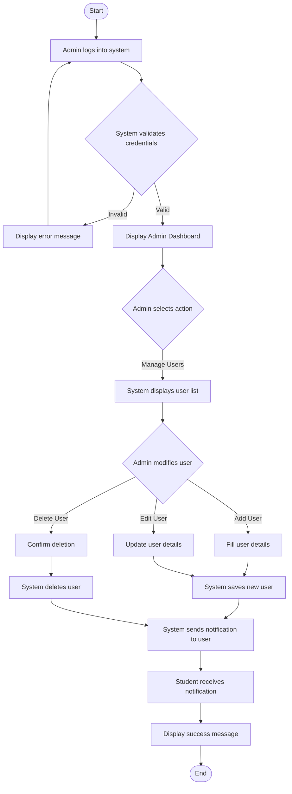
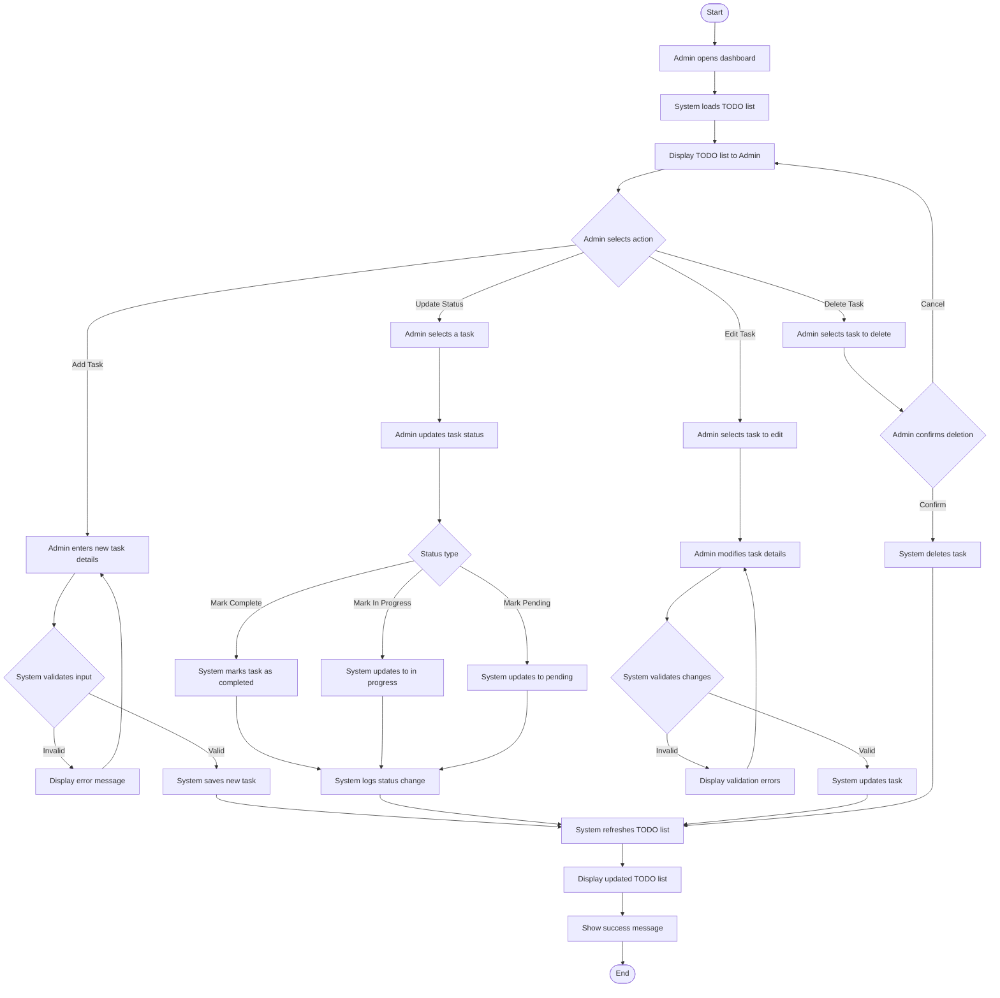
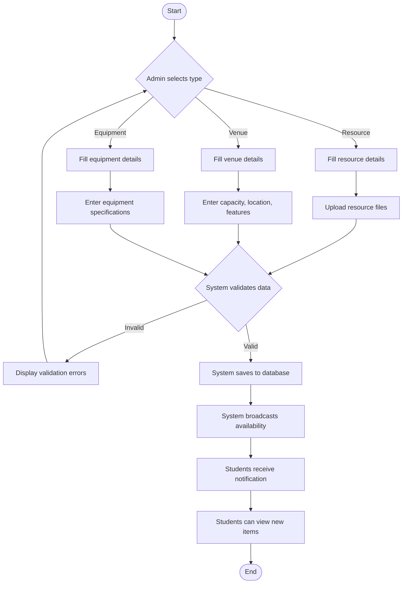
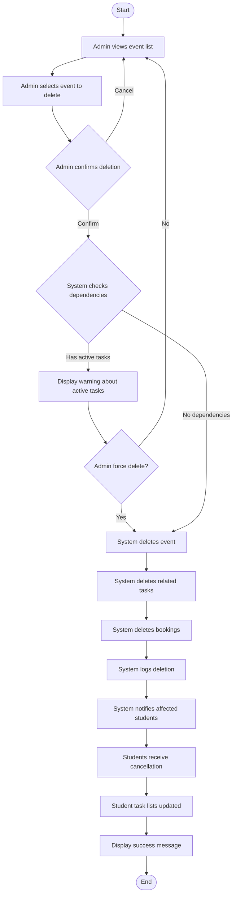
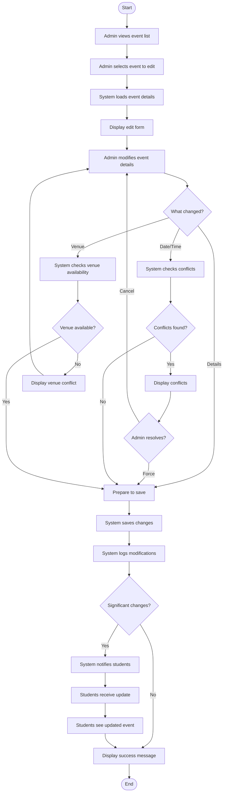
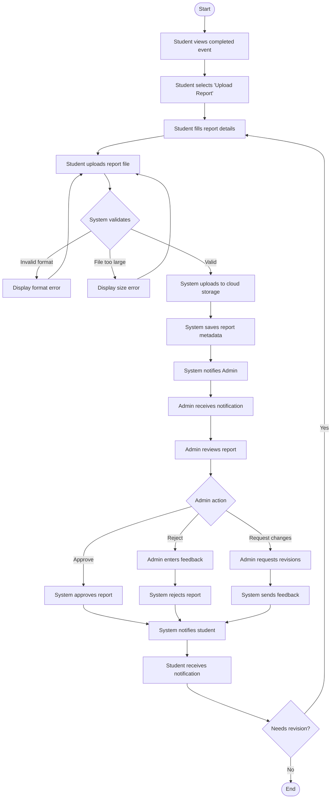
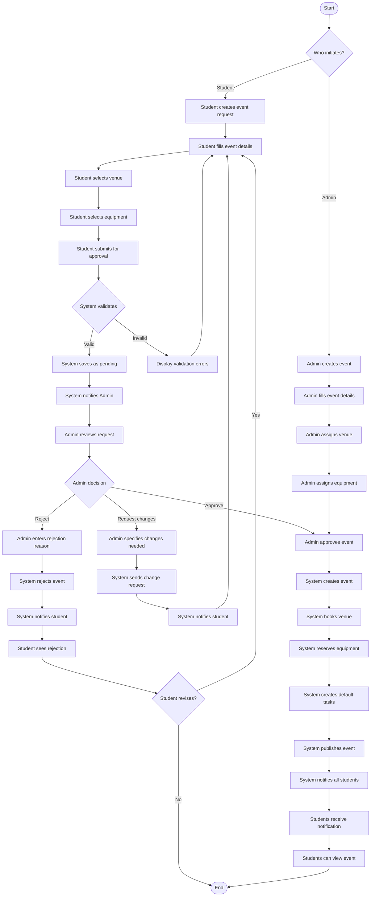

# Activity Diagrams - Schedulink System

## 1. Admin Management Flow

## 2. Admin TODO List Management Flow

## 3. Add Resources/Venue/Equipment Flow

## 4. Delete Event Flow

## 5. Edit Event Flow

## 6. Report Upload Flow

## 7. Event Creation & Approval Flow

## Flow Legend

**Actors:**
- **Admin**: System administrator with full privileges
- **System**: Backend processing and validation
- **Student**: End users (students/members)

**Actions:**
- Rectangles: Process/Action steps
- Diamonds: Decision points
- Rounded rectangles: Start/End points
- Arrows: Flow direction

**Notification Flow:**
- Admin → System → Student (for approvals, notifications)
- Student → System → Admin (for requests, submissions)
- System → All (for broadcasts)
