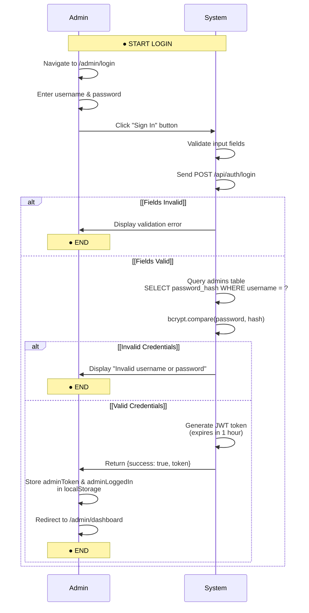
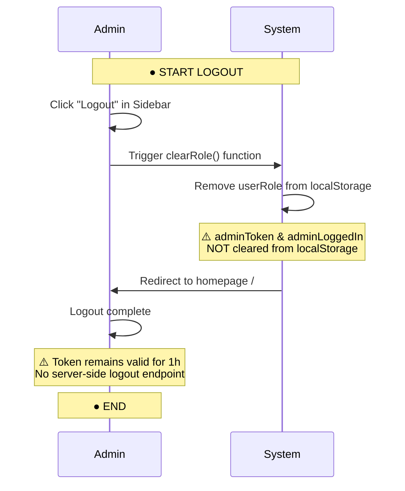
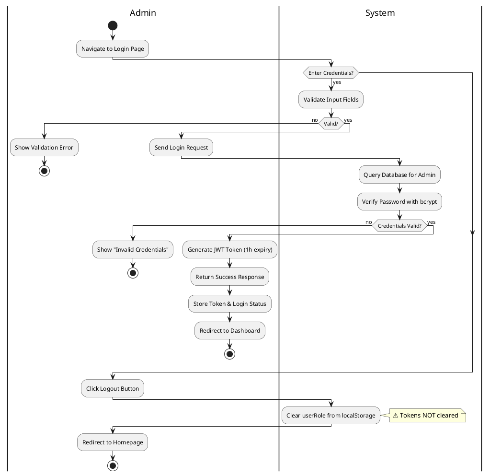

# Activity Diagram - Admin Login & Logout

## How to View

1. Go to https://mermaid.live/
2. Copy the code below
3. Paste it in the editor
4. Download as PNG or SVG

---

## Login Flow

---

## Logout Flow

## Key Components

**Frontend Files:**
- [app/admin/login/page.tsx](../app/admin/login/page.tsx) - Login form UI
- [components/Sidebar.tsx](../components/Sidebar.tsx) - Logout button
- [components/RoleContext.tsx](../components/RoleContext.tsx) - Role management

**Backend Files:**
- [backend/auth.js](../backend/auth.js) - Login endpoint & JWT generation

**Database:**
- `admins` table: Stores username, password_hash

**Security Notes:**
- ✅ Passwords hashed with bcrypt (saltRounds = 10)
- ✅ JWT tokens expire in 1 hour
- ⚠️ Logout only clears `userRole`, not tokens
- ⚠️ No token revocation mechanism
- ⚠️ Tokens remain valid until expiry even after logout

**API Details:**
- `POST /api/auth/login` - Validates credentials, returns JWT
- No logout endpoint (client-side only)

**LocalStorage Keys:**
- `adminToken`: JWT token for API authentication
- `adminLoggedIn`: Boolean flag for UI state
- `userRole`: Role for sidebar menu customization

---

## PlantUML Activity Diagram (Alternative Format)

---

## Flow Summary

**Login Process:**
1. Admin navigates to login page
2. Enters username/password
3. Frontend validates fields
4. POST request to `/api/auth/login`
5. Backend queries `admins` table
6. bcrypt password verification
7. JWT token generation (1h expiry)
8. Store token in localStorage
9. Redirect to dashboard

**Logout Process:**
1. Admin clicks logout in sidebar
2. `clearRole()` removes `userRole` from localStorage
3. Redirect to homepage
4. Tokens remain valid until expiry (no server logout)

**Security Considerations:**
- Client-side logout doesn't invalidate tokens
- Tokens valid for 1 hour regardless of logout
- No server-side session management
- Relies on JWT expiry for security
