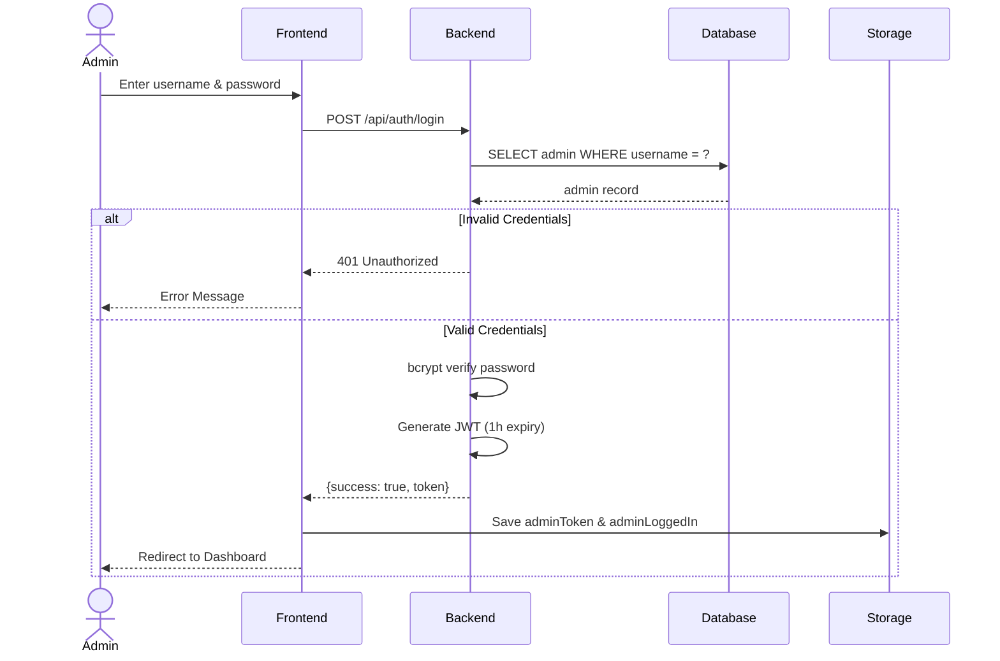
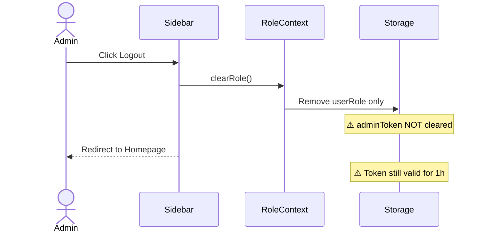

# Sequence Diagram - Login & Logout

## How to View

1. Go to https://mermaid.live/
2. Copy the code below
3. Paste it in the editor
4. Download as PNG or SVG

---

## Login Flow

---

## Logout Flow

## Key Components

**Files:**
- [backend/auth.js](../backend/auth.js) - Login endpoint
- [backend/authMiddleware.js](../backend/authMiddleware.js) - Token verification
- [app/admin/login/page.tsx](../app/admin/login/page.tsx) - Login UI
- [components/Sidebar.tsx](../components/Sidebar.tsx) - Logout button
- [components/RoleContext.tsx](../components/RoleContext.tsx) - clearRole()

**API:**
- `POST /api/auth/login` - Admin login (returns JWT token)
- No logout endpoint (frontend only)

**Security:**
- JWT token expires in 1 hour
- bcrypt password hashing
- ⚠️ Logout doesn't clear tokens from localStorage
- ⚠️ No token revocation mechanism
