# Sequence Diagram - Event Approval (Mermaid Version)

## How to View This Diagram

1. Go to https://mermaid.live/
2. Copy the code below
3. Paste it in the editor
4. Download as PNG or SVG

---

## Mermaid Code - Event Creation

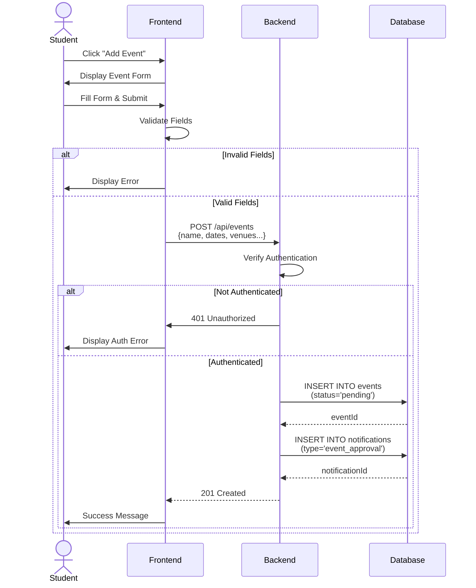

---

## Event Approval by Admin

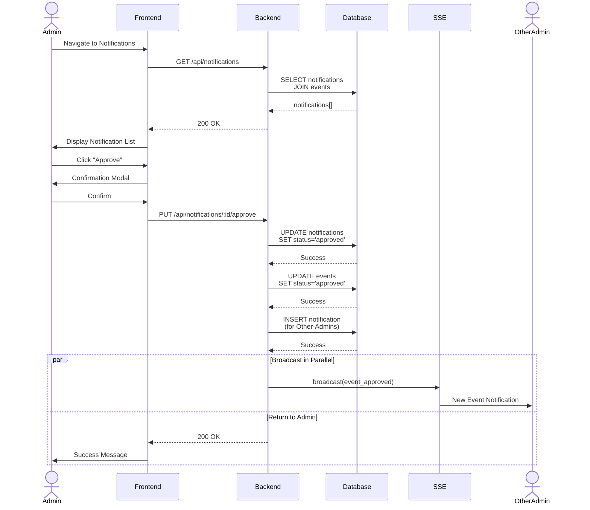

---

## Report Upload Flow

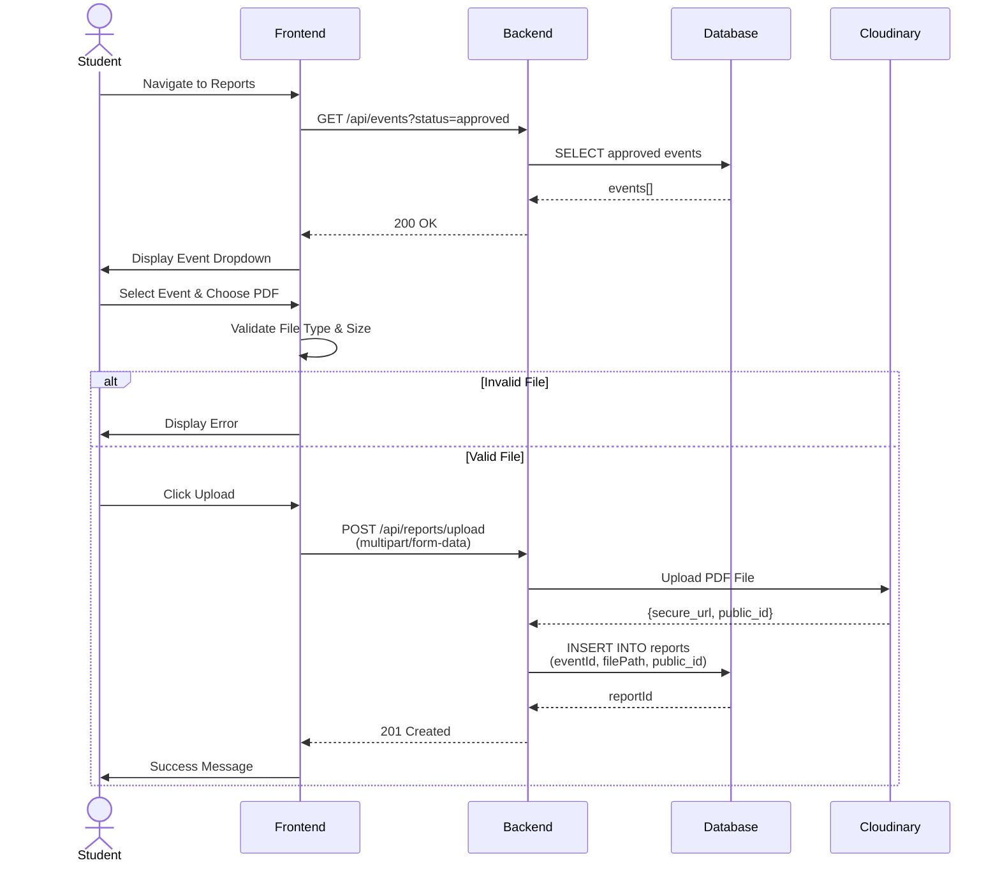

---

## Simplified Event Approval

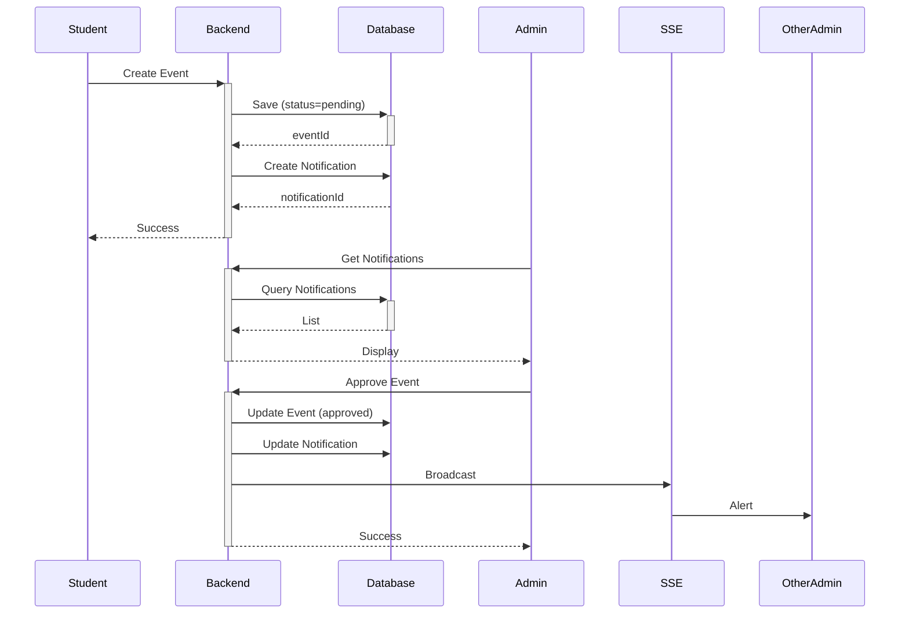

---

## Edit Event Flow

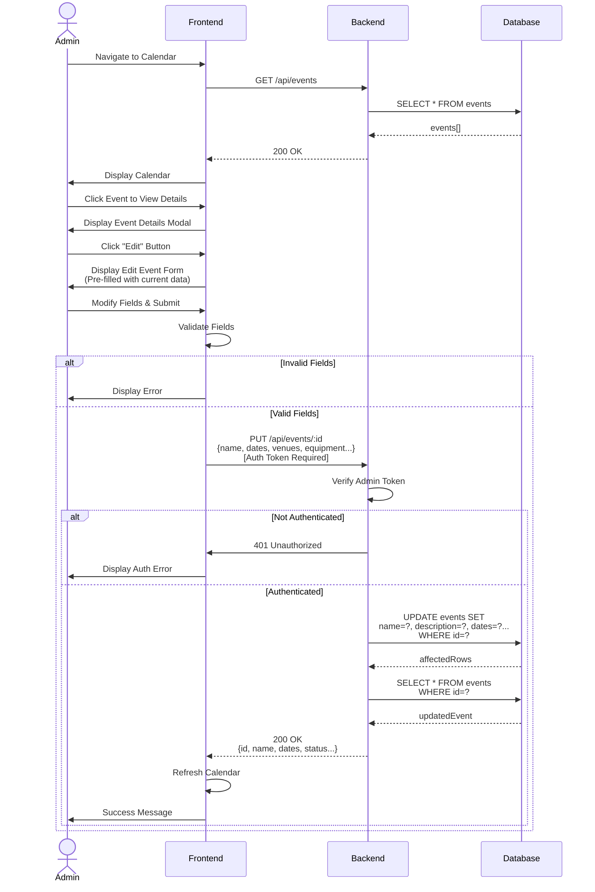

---

## Delete Event Flow

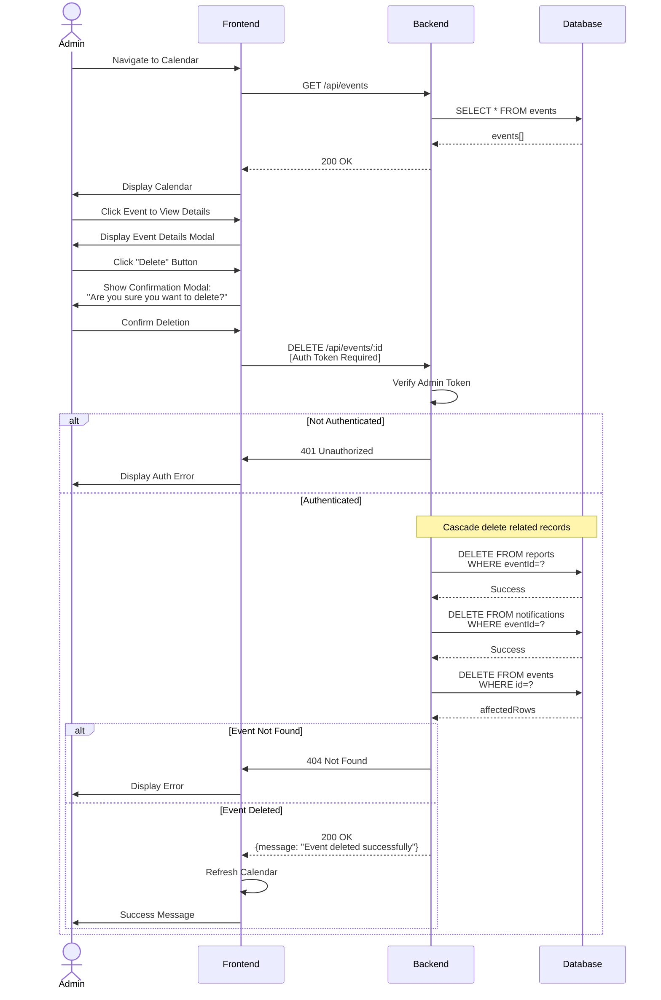

---

## Add Resource (Equipment) Flow

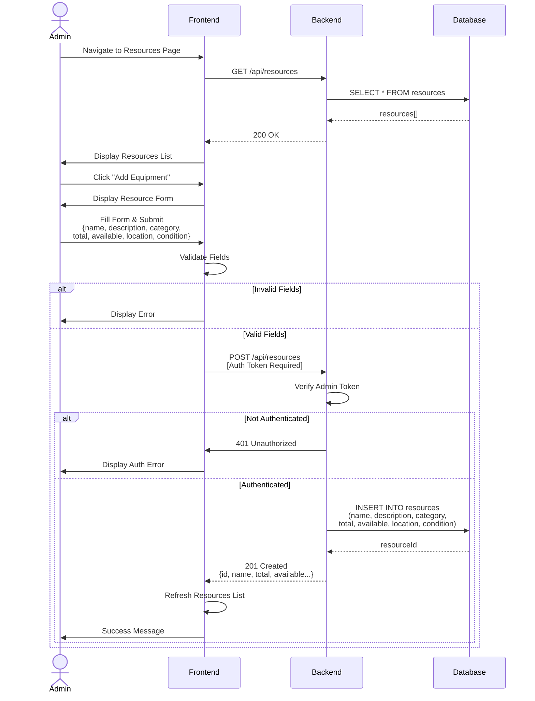

---

## Add Venue Flow

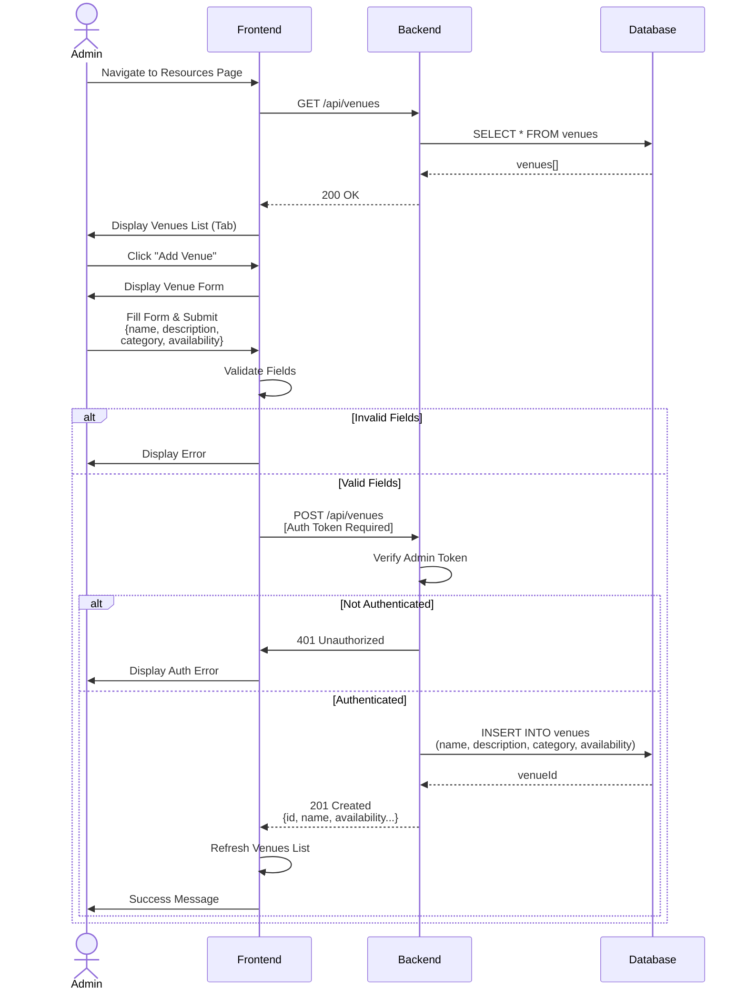

---

## Add Task (To-Do) Flow

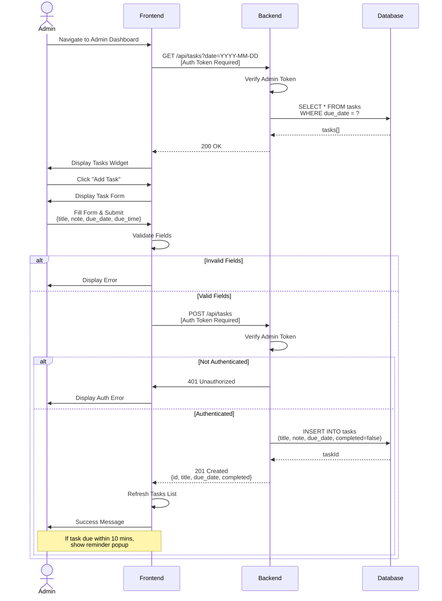

---

## Update Task Status Flow

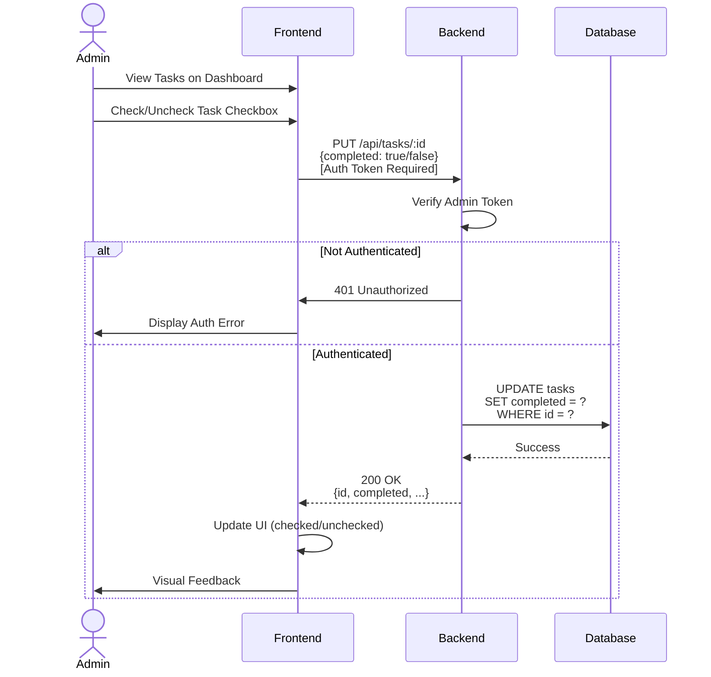

---

## Simplified Resource/Venue/Task Creation

```mermaid
sequenceDiagram
    Admin->>+Frontend: Click "Add" (Resource/Venue/Task)
    Frontend->>Admin: Display Form

    Admin->>Frontend: Fill & Submit
    Frontend->>Frontend: Validate

    alt Invalid
        Frontend->>-Admin: Error
    else Valid
        Frontend->>+Backend: POST /api/{resource|venue|task}
        Backend->>Backend: Verify Admin Token
        Backend->>+Database: INSERT INTO {table}
        Database-->>-Backend: newId
        Backend-->>-Frontend: 201 Created
        Frontend->>-Admin: Success & Refresh List
    end
```

---

## Add New Admin Flow

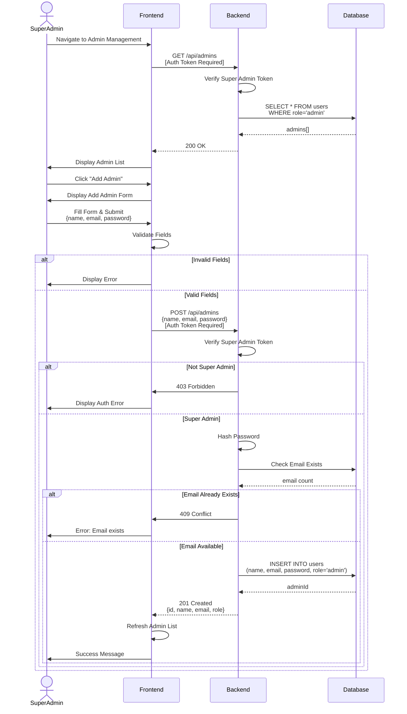

---

## Notes

**Mermaid Sequence Diagrams:**
- ✅ Clean and simple syntax
- ✅ Automatic layout
- ✅ Good for basic flows
- ✅ Supports alt/par/opt frames

**Syntax Guide:**
- `actor` - Stick figure
- `participant` - Box
- `->>` - Solid arrow (sync)
- `-->>` - Dashed arrow (return)
- `alt/else/end` - Alternative paths
- `par/and/end` - Parallel execution

**Sequence Diagrams Created:**
1. Event Creation
2. Event Approval by Admin
3. Report Upload Flow
4. Simplified Event Approval
5. Edit Event Flow
6. Delete Event Flow
7. Add Resource (Equipment) Flow
8. Add Venue Flow
9. Add Task (To-Do) Flow
10. Update Task Status Flow
11. Simplified Resource/Venue/Task Creation
12. Add New Admin Flow

**Total: 12 Sequence Diagrams**

**API Endpoints Used:**
- `POST /api/events` - Create event
- `PUT /api/events/:id` - Edit event
- `DELETE /api/events/:id` - Delete event
- `POST /api/resources` - Add equipment
- `POST /api/venues` - Add venue
- `POST /api/tasks` - Add task
- `PUT /api/tasks/:id` - Update task status
- `GET /api/events` - List events
- `GET /api/resources` - List resources
- `GET /api/venues` - List venues
- `GET /api/tasks?date=YYYY-MM-DD` - List tasks
- `POST /api/reports/upload` - Upload report
- `PUT /api/notifications/:id/approve` - Approve notification
- `GET /api/admins` - List admins (Super Admin only)
- `POST /api/admins` - Add new admin (Super Admin only)

**Authentication:**
- All POST/PUT operations require Admin JWT token
- Token sent in Authorization header
- 401 error if not authenticated

**Limitations:**
- ⚠️ Less detailed than PlantUML
- ⚠️ Limited styling options
- ⚠️ No activation boxes control
